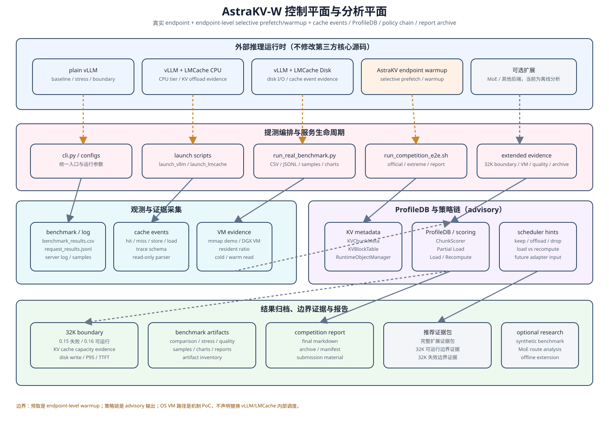
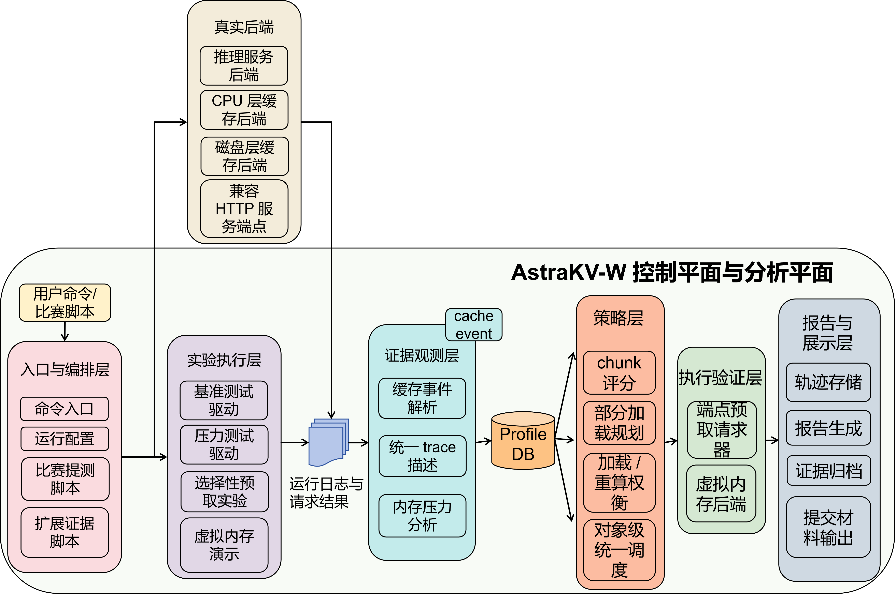
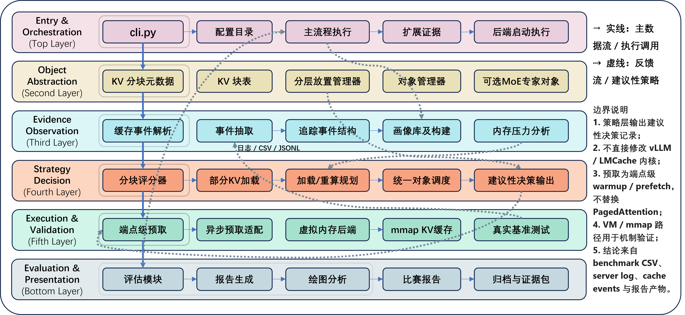
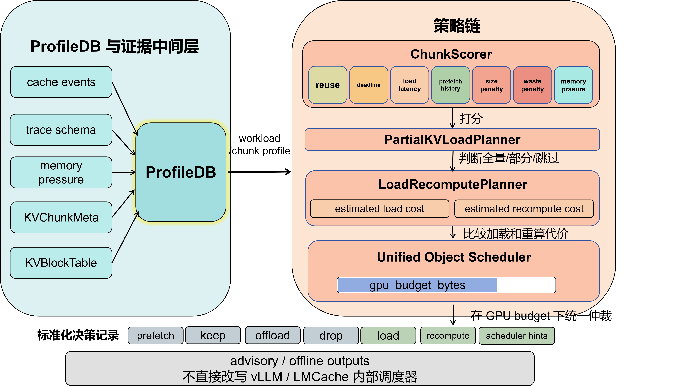
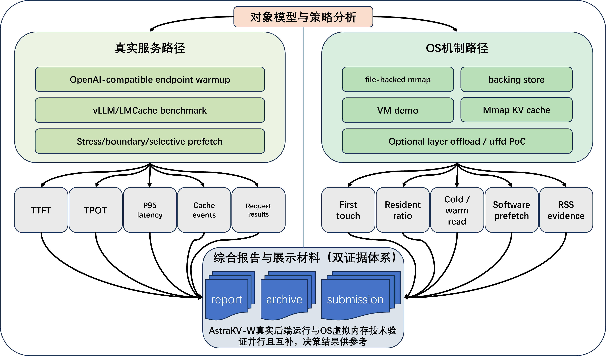
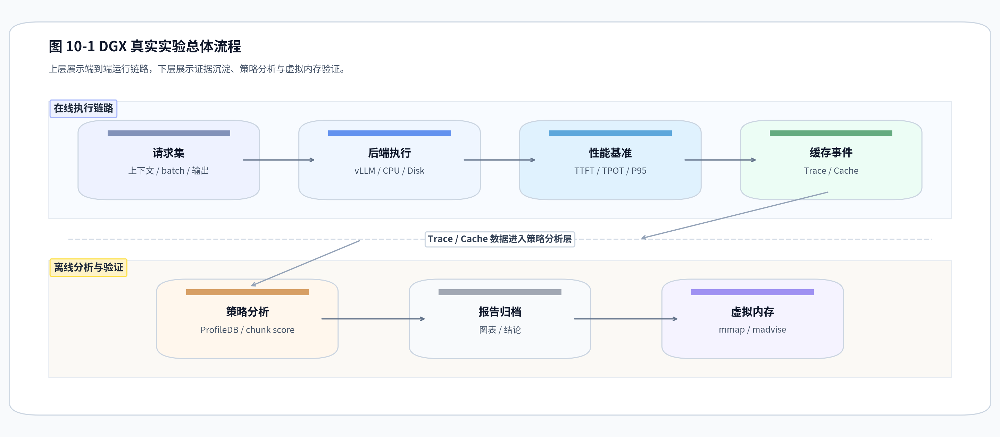
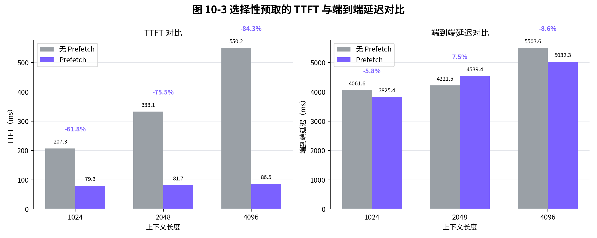
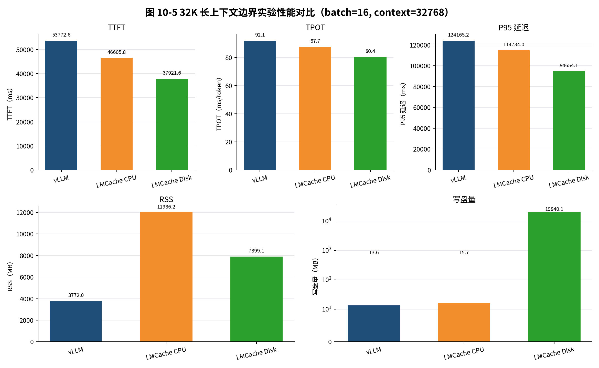
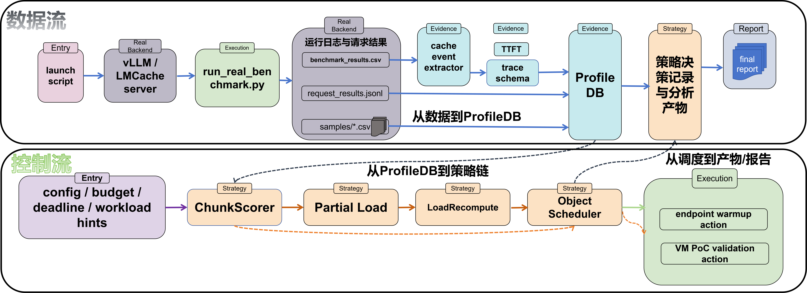
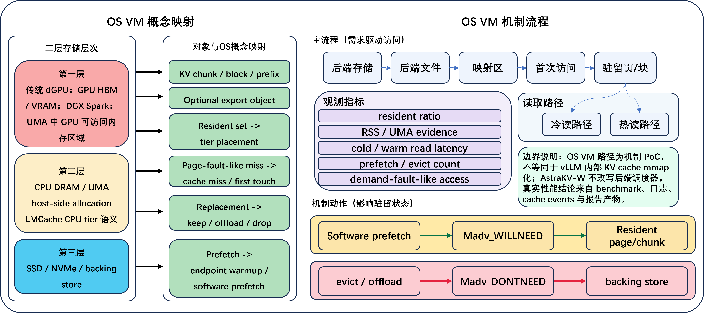

# AstraKV-W

AstraKV-W 是面向操作系统设计赛功能挑战赛道 proj59 的研究工程项目，主题是“**内存受限环境下的大语言模型推理优化**”。项目围绕 LLM 推理中的 KV Cache 膨胀、分层缓存、预取隐藏 I/O 延迟、虚拟内存机制映射和可复核实验链路展开。

当前实现采用低侵入路线：不直接修改 vLLM、LMCache、SGLang、TensorRT-LLM、FlashAttention 或 CUDA kernel 的第三方核心源码，而是在真实 OpenAI-compatible endpoint 外围构建对象抽象、证据采集、策略分析、OS VM PoC、benchmark 和报告归档链路。

- 演示视频链接：[pan.baidu.com/s/1Jb1h1_4G8QAU-CLX_44y0g?pwd=nvpq](https://pan.baidu.com/s/1Jb1h1_4G8QAU-CLX_44y0g?pwd=nvpq)
- 报告文档：docs/OS功能挑战赛道proj59——报告文档.pdf
- 演示PPT：docs/AstraKV-W：项目开发与管理报告.pptx

## 快速演示

推荐用于答辩录屏或现场展示的入口：

```bash
cd /home/szl/Desktop/Inference-OS
source .venv/bin/activate
bash scripts/entrypoints/run_architecture_demo.sh --skip-install --continue-on-failure
```

该 demo 会记录运行环境，执行脚本检查、报告链路测试和 mmap VM smoke，并复用已归档 DGX/vLLM/LMCache evidence 生成演示报告；已运行示例是最近一次演示产物。

## 1. 目标描述

项目目标是把大模型推理中的内存受限问题转化为一个可观测、可分析、可调度、可复现的系统问题。具体包括：

- 建立 KV chunk、block table、tier placement、request trace 等统一对象抽象。
- 采集 benchmark、server log、cache event、memory sample、ProfileDB 等运行证据。
- 输出 chunk score、partial load、load-vs-recompute、keep/offload/drop 等建议性策略。
- 在真实 vLLM/LMCache endpoint 上验证 baseline、prefetch、stress 和 32K boundary。
- 用 mmap、MADV_DONTNEED、MADV_WILLNEED、resident ratio、cold/warm read 等机制展示 OS 虚拟内存思想在项目中的落点。

AstraKV-W 不是重写推理引擎，而是在成熟后端外围构建面向内存管理的控制平面、证据平面和演示验证链路。

## 2. 比赛题目分析和相关资料调研

赛题要求关注内存受限环境中的大模型推理优化，核心可以拆成三条线：

| 赛题关注点         | AstraKV-W 对应实现                                                                      |
| ------------------ | --------------------------------------------------------------------------------------- |
| 访存行为分析       | vLLM/LMCache benchmark、cache event 抽取、trace schema、ProfileDB、memory pressure 分析 |
| 虚拟内存与分层缓存 | LMCache CPU/Disk tier、mmap KV cache、DGX Spark VM evidence、32K boundary               |
| 预取隐藏 I/O 延迟  | endpoint-level selective prefetch/warmup、prefetch events、TTFT 对比、policy ablation   |

项目调研参考了 CPU/GPU 协同、KV Cache 分层管理、选择性加载、load-vs-recompute、KV 压缩、MoE expert routing 和 OS 虚拟内存机制等方向。相关分析见：

- `docs/analysis/third_party_analysis.md`
- `docs/architecture/runtime_architecture.md`
- `docs/architecture/prefetch_design.md`
- `docs/guides/base_version_and_contribution_cn.md`

## 3. 系统框架设计

AstraKV-W 的总体控制平面与分析平面如下：



这张图把项目拆成五个层次：

- 外部推理运行时：plain vLLM、LMCache CPU、LMCache Disk，以及用于前缀预热的 endpoint 级策略。
- 提测编排与服务生命周期：统一入口、启动脚本、benchmark、E2E 和扩展证据脚本。
- 观测与证据采集：benchmark 结果、cache events、VM evidence 和 server log。
- ProfileDB 与策略链：把观测结果转成 advisory 形式的 chunk score、load/recompute 和 scheduler hint。
- 结果归档与报告：把边界实验、图表、报告和归档包组织成可复核材料。

与下面这组展示图相比，这张图更适合在答辩里先讲清楚“系统怎么分层、证据怎么流转、策略怎么输出”。

历史版概览图：



系统按六层组织：



| 层次         | 主要路径                                                    | 作用                                                                              |
| ------------ | ----------------------------------------------------------- | --------------------------------------------------------------------------------- |
| 入口与编排层 | `cli.py`, `scripts/entrypoints/`, `configs/`          | 统一启动、测试、benchmark、报告和演示入口                                         |
| 对象抽象层   | `astrakv/kv_cache/`                                       | 建模 KV chunk、block table、partial load 和 tier placement                        |
| 证据观测层   | `astrakv/runtime/`                                        | 采集 trace、cache event、ProfileDB、memory pressure 和 endpoint prefetch evidence |
| 策略决策层   | `astrakv/prefetch/`, `astrakv/scheduler/`               | 生成 chunk score、prefetch hint、load/recompute、keep/offload/drop 建议           |
| 执行验证层   | vLLM/LMCache endpoint,`astrakv/vm/`                       | 通过真实服务路径和 OS mmap 路径双线验证                                           |
| 评估展示层   | `scripts/reporting/`, `scripts/plotting/`, `results/` | 生成 comparison、stress、quality、policy、figure、archive 和 demo report          |

核心设计原则：

- 对象统一建模：把 KV cache 相关对象变成可分析单元。
- 证据统一组织：把日志、CSV、JSONL 和报告归档成可复核 artifact。
- 策略分层决策：从 ProfileDB 到 scorer，再到 load/recompute 和 scheduler hint。
- 执行双路径验证：真实 endpoint 验证工程效果，OS VM PoC 验证机制映射。
- 结果结构化输出：所有关键结论都能回到脚本、日志、CSV、JSON 或 Markdown 报告。

ProfileDB 与策略链的关系：



真实服务路径与 OS 机制路径的双证据体系：



架构图与详细说明见：

- 架构总览图
- 六层架构图
- 策略链图
- 双路径验证图
- `docs/architecture/architecture_layers_cn.md`
- `docs/guides/demo_walkthrough_script_cn.md`

## 4. 配置方式

项目采用“环境变量 + 启动脚本 + YAML/SH 配置”三段式方式组织运行配置。

### 4.1 运行环境

常用顺序如下：

```bash
cd /home/szl/Desktop/Inference-OS
source .venv/bin/activate
source configs/dgx_spark_env.sh
export ASTRAKV_MODEL="$PWD/models/Qwen2.5-7B-Instruct"
```

### 4.2 主线入口

- 轻量演示：`bash scripts/entrypoints/run_architecture_demo.sh --skip-install --continue-on-failure`
- 扩展证据：`bash scripts/entrypoints/run_competition_extended_evidence.sh --skip-install --continue-on-failure`
- 主线提测：`bash scripts/entrypoints/run_competition_e2e.sh --skip-install --continue-on-failure`
- 本地测试：`python cli.py test`

### 4.3 配置文件

主线配置集中在三类文件：

- 运行环境配置：用于统一模型路径、基础环境变量和实验依赖。
- 后端配置：用于区分 plain vLLM、LMCache CPU、LMCache Disk 和 selective prefetch。
- 压测配置：用于控制 boundary、stress、context length、batch size 和输出 token。

常见做法是先选入口脚本，再按实验目标切换对应配置，不直接修改第三方推理引擎内部实现。

模型下载和本地目录约定见 `models/README.md`。

## 5. 开发计划

项目按五个阶段推进：

| 阶段               | 计划内容                                                   | 当前状态 |
| ------------------ | ---------------------------------------------------------- | -------- |
| 赛题分析与调研     | 明确技术路线、相关系统和可行性边界                         | 已完成   |
| 对象框架与合成实验 | 实现 KV metadata、prefetch MVP、初版 benchmark             | 已完成   |
| 真实后端接入       | 跑通 plain vLLM、LMCache CPU、LMCache Disk endpoint        | 已完成   |
| 工程化与 OS VM     | 完成`astrakv/` 包化、CLI、mmap VM PoC、DGX Spark adapter | 已完成   |
| 比赛冲刺与归档     | 完成 extended evidence、32K boundary、报告、图表和演示材料 | 已完成   |

开发计划与任务跟踪见：

- `docs/planning/IMPLEMENTATION_PLAN.md`
- `docs/planning/COMPETITION_TASKS.md`
- `docs/planning/TASK_REPORT.md`

## 6. 比赛过程中的重要进展

关键进展如下：

- 形成“真实服务路径 + OS 机制路径”的双主线设计。
- 跑通 vLLM、LMCache CPU、LMCache Disk 三类真实 endpoint。
- 完成 `astrakv/` 核心包、CLI、entrypoint scripts、reporting 和 plotting 链路。
- 完成 endpoint-level selective prefetch/warmup 实验，并在重复前缀场景下显著降低 TTFT。
- 完成 32K/batch16/output256 边界实验，记录 `gpu_memory_utilization=0.15` 失败下界与 `0.16` 可运行上界。
- 完成 cache event -> trace/ProfileDB -> chunk score -> policy ablation -> scheduler hint 的建议性策略链路。
- 完成 mmap KV cache VM smoke、DGX Spark VM evidence 和 demo report。
- 补充 MoE expert route trace 离线分析，用于专家激活访存行为分析扩展。

推荐展示入口：

```bash
bash scripts/entrypoints/run_architecture_demo.sh --skip-install --continue-on-failure
```

完整证据入口：

```bash
bash scripts/entrypoints/run_competition_extended_evidence.sh --skip-install --continue-on-failure
```

## 7. 系统测试情况

### 7.1 实验链路总览



### 7.2 快速演示测试

本地 architecture demo 已运行：

```text
最近一次演示产物
```

关键结果：

| 项目                       | 结果                                                        |
| -------------------------- | ----------------------------------------------------------- |
| Python                     | `3.12.3`                                                  |
| Platform                   | `Linux-6.11.0-1014-nvidia-aarch64-with-glibc2.39`         |
| 报告链路测试               | `19 passed`                                               |
| mmap VM smoke              | cold read`0.11 ms`, warm read `0.05 ms`, speedup `2x` |
| Prefetch 平均 TTFT change  | `-73.79%`                                                 |
| 32K failure lower bound    | required KV cache`1.75 GiB`, available `1.67 GiB`       |
| 32K pass boundary          | `gpu_memory_utilization=0.16` 可运行                      |
| LMCache Disk boundary 写盘 | `19840.1055 MB`                                           |
| boundary disk cache events | `18956` rows                                              |

### 6.3 关键结果图

Selective Prefetch 在重复前缀场景下主要改善首 Token 延迟：



32K 长上下文边界实验展示内存受限条件下的性能、成功边界和写盘代价：



Cache Event 到策略链的分析路径：



OS 虚拟内存机制实验展示 mmap、换出、预取和 cold/warm read 差异：



### 6.4 推荐测试命令

轻量演示：

```bash
bash scripts/entrypoints/run_architecture_demo.sh --skip-install --continue-on-failure
```

本地单元测试：

```bash
python cli.py test
```

无 GPU 的 mmap 虚拟内存演示：

```bash
python cli.py vm mmap --blocks 100 --block-size-mb 1 --output-dir results/vm_mmap_smoke
```

完整扩展证据：

```bash
bash scripts/entrypoints/run_competition_extended_evidence.sh --skip-install --continue-on-failure
```

图表生成：

```bash
bash scripts/entrypoints/run_experiment_figures.sh --skip-install
```

更详细的复现流程见：

- `docs/guides/competition_test_flow_cn.md`
- `docs/guides/reproduction.md`
- `scripts/README.md`

## 8. 遇到的主要问题和解决方法

| 问题                                                   | 处理方式                                                                                             |
| ------------------------------------------------------ | ---------------------------------------------------------------------------------------------------- |
| 本地环境缺少 CUDA、vLLM、LMCache 和模型权重            | 区分本地离线回归与 DGX 真实实验；本地跑 CLI、reporting、VM smoke，DGX 跑真实 endpoint                |
| endpoint warmup 与内部 KV block prefetch 粒度不同      | 明确当前真实路径是 endpoint-level warmup/prefetch，不声明替换 vLLM 内部 scheduler                    |
| DGX Spark case-level GPU framebuffer memory 不稳定可见 | 不把`gpu_memory_peak_mb` 作为核心结论，使用 RSS、disk I/O、KV capacity、server log 和成功/失败边界 |
| 真实实验耗时长，不适合现场完整重跑                     | 提供`run_architecture_demo.sh` 复用归档 evidence，并补跑轻量检查和 mmap smoke                      |
| LMCache 配置项和版本可能变化                           | 保留 server log、commands.log、artifact inventory，并在正式复现前检查 connector/backend 是否生效     |
| 结果材料体积较大                                       | `results/` 可作为本地证据包和外部提交材料，不强行全部进入 Git 仓库                                 |

常见环境问题处理见：

- `docs/guides/dgx_spark_setup.md`
- `docs/guides/GPU_TESTING_WORKFLOW_CN.md`

## 9. 分工和协作

项目由三名成员协作完成：

| 成员   | 主要分工                                                                                     |
| ------ | -------------------------------------------------------------------------------------------- |
| 宋卓伦 | 运行时与基准测试相关开发实验；vLLM/LMCache 对接；真实 endpoint benchmark；DGX 实验数据采集   |
| 赵雨萱 | KV 缓存、trace 与策略研发；对象抽象、ProfileDB、chunk score、partial load、load-vs-recompute |
| 何立烽 | OS/VM 机制验证；mmap VM demo、DGX Spark adapter、layer offload 等扩展研究 PoC                |

AI 工具使用已按比赛要求披露，见：

```text
docs/ai_usage/README.md
```

AI 辅助主要用于仓库阅读、模块梳理、文档草拟、实验结果整理和合规检查；不用于伪造 benchmark 结果或替代 DGX 实验执行。

## 10. 提交仓库目录和文件描述

| 路径                     | 说明                                                                          |
| ------------------------ | ----------------------------------------------------------------------------- |
| `astrakv/`             | 主 Python 包                                                                  |
| `astrakv/runtime/`     | trace、ProfileDB、cache event、memory pressure、endpoint prefetch、VM backend |
| `astrakv/kv_cache/`    | KV chunk 元数据、block table、partial load 规划                               |
| `astrakv/prefetch/`    | 异步预取生命周期、选择性预取 MVP、chunk scorer                                |
| `astrakv/scheduler/`   | load/recompute/offload/drop 等调度 hint                                       |
| `astrakv/vm/`          | mmap KV cache、DGX Spark UMA adapter、userfaultfd/layer offload 可选 PoC      |
| `configs/`             | DGX Spark、vLLM、LMCache、stress、AstraKV 运行配置                            |
| `scripts/entrypoints/` | 一键安装、演示、E2E、extended evidence、图表生成入口                          |
| `scripts/benchmark/`   | 真实 endpoint benchmark、prefetch benchmark、cache event 抽取                 |
| `scripts/reporting/`   | competition report、policy ablation、architecture demo report 等              |
| `scripts/plotting/`    | 论文/答辩图表生成                                                             |
| `tests/`               | 单元测试和报告链路测试                                                        |
| `docs/`                | 架构、分析、复现、合规、AI 使用                                               |
| `results/`             | 运行指令后可得到本地运行产物和大型 evidence                                   |

提交与合规说明：

- 源代码采用 MIT License，见 `LICENSE`。
- 技术文档、报告、PPT 和演示视频等非代码材料采用 CC BY-SA 4.0。
- 第三方系统作为外部后端或参考系统使用，本队增量见 `docs/guides/base_version_and_contribution_cn.md`。
- 许可证、第三方边界和 AI 披露见 `docs/guides/license_and_submission_notice.md`。

## 11. 比赛收获

本项目把一个“LLM 推理内存优化”题目落实成了完整工程链路：

- 从赛题拆解上，明确了访存行为分析、分层缓存、预取、虚拟内存机制和真实实验边界。
- 从系统设计上，形成了对象抽象、证据组织、策略分析、执行验证、报告归档的闭环。
- 从工程实现上，完成了真实 endpoint、CLI、entrypoint scripts、reporting、plotting、VM PoC 和 demo package。
- 从实验方法上，建立了 baseline、prefetch、stress、32K boundary、cache event、policy ablation、quality check、OS VM evidence 的多维评估。
- 从比赛规范上，补齐了基础版本与增量贡献、许可证声明、AI 工具披露和演示讲稿。

## 文档入口

| 文档                                                | 说明                                  |
| --------------------------------------------------- | ------------------------------------- |
| `docs/报告文档.pdf`                               | 项目完整报告                          |
| `docs/AstraKV-W：项目开发与管理报告.pptx`         | 答辩 PPT                              |
| `docs/guides/demo_walkthrough_script_cn.md`       | 演示流程与讲稿                        |
| `docs/guides/competition_test_flow_cn.md`         | 比赛测试流程和 evidence 说明          |
| `docs/guides/license_and_submission_notice.md`    | 许可证、第三方边界、AI 披露与提交说明 |
| `docs/guides/base_version_and_contribution_cn.md` | 基础版本、参照系统和增量贡献          |
| `docs/architecture/`                              | 系统架构文档                          |
| `docs/analysis/`                                  | 项目分析和第三方系统分析              |
| `docs/planning/`                                  | 开发计划和任务记录                    |
| `docs/ai_usage/`                                  | AI 工具使用记录                       |
