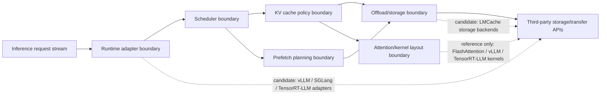

# Interface Boundaries

Status: boundary map for the current evidence-driven implementation.

## Purpose

This document defines the boundaries AstraKV-W should respect while using real
vLLM/LMCache endpoints. The current implementation runs real benchmarks and
endpoint-level warmup requests through scripts, but it still avoids modifying
third-party runtime internals or kernels.

## Boundary Diagram

## Boundary Rules

| Boundary | AstraKV-W owns | Third-party owns | Current action |
| --- | --- | --- | --- |
| Runtime adapter | Launch wrappers, endpoint calls, logs, stable adapter contracts | Runtime engine internals | Implemented at endpoint/script boundary |
| Scheduler | Memory-aware advisory decisions and scheduler hints | Existing request scheduler implementation | Advisory only |
| KV cache policy | Metadata model, ProfileDB, chunk scoring, cache event accounting | Existing KV allocators and kernel layouts | Evidence + advisory policy |
| Prefetch planning | Endpoint-level selective warmup and trace schema | Runtime execution and kernel prefetch | Implemented as endpoint warmup |
| Offload/storage | Tier-selection policy and adapter selection | LMCache/vLLM/SGLang storage internals | LMCache CPU/Disk used externally |
| Kernel layout | Compatibility constraints | CUDA/CUTE/Triton kernels | Read-only reference |

## Candidate Integration Paths

| Path | Entry point | Benefit | Risk |
| --- | --- | --- | --- |
| LMCache-first | `lmcache/v1/cache_engine.py`, storage backends, runtime integrations | Fastest path to cache/offload/prefetch research | Scheduler behavior remains external |
| vLLM-connector-first | `vllm/distributed/kv_transfer/kv_connector/v1/` | Natural serving integration and existing LMCache connector | vLLM internals change quickly |
| SGLang-cache-first | `python/sglang/srt/mem_cache/` and scheduler manager paths | Strong scheduler/cache coupling and radix cache | More runtime-specific |

## Non-Goals For Current Stage

- No scheduler replacement.
- No claim that vLLM internal KV scheduler has been replaced.
- No CUDA/Triton/CUTE kernel changes.
- No third-party source modifications.
- No case-level GPU framebuffer memory claim on DGX Spark when `nvidia-smi`/NVML
  do not expose it.

