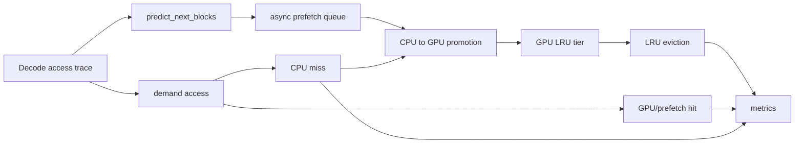

# Selective KV Prefetch MVP Design

Status: synthetic MVP implemented; real endpoint prefetch is implemented in
`runtime/endpoint_prefetch.py` and `scripts/run_selective_prefetch_real.py`.

Date: 2026-05-25

## Goal

Implement a minimal decode-stage Selective KV Prefetch mechanism that predicts
the next KV blocks likely to be accessed and asynchronously promotes them from
CPU tier to GPU tier before demand access.

The MVP is runtime-agnostic and pure Python. It does not modify vLLM, does not
implement a scheduler, and does not use CUDA. The current competition evidence
uses endpoint-level warmup requests on top of vLLM + LMCache, not an internal
KV block scheduler replacement.

## Non-Goals

- No CUDA kernel implementation.
- No paged-attention implementation.
- No direct vLLM/SGLang/TensorRT-LLM integration.
- No complex prediction or optimization policy.
- No modification of third-party source code.

## Implemented Components

| Component | File | Role |
| --- | --- | --- |
| `SelectiveKVPrefetchMVP` | `prefetch/selective_kv.py` | Main two-tier KV prefetch engine. |
| `SelectiveKVPrefetchConfig` | `prefetch/selective_kv.py` | Tunable MVP parameters. |
| `KVBlockRef` | `prefetch/selective_kv.py` | Logical KV block descriptor. |
| `KVResidentBlock` | `prefetch/selective_kv.py` | GPU/CPU residency metadata. |
| `PrefetchQueueItem` | `prefetch/selective_kv.py` | Async queue payload. |
| `SelectivePrefetchMetrics` | `prefetch/selective_kv.py` | Hit, waste, queue, eviction, and memory counters. |
| `SelectivePrefetchBenchmarkBackend` | `scripts/benchmark_runner.py` | Synthetic benchmark harness comparing no-prefetch vs selective prefetch. |

## Two-Tier Model

The MVP models two KV tiers:

- CPU tier: backing store for all logical KV blocks.
- GPU tier: limited-capacity active KV tier with LRU eviction.

No tensors are allocated. A block is represented by a `KVBlockRef` containing a
logical `block_id` and `size_bytes`.

## Decode-Stage Flow



For each decode position:

1. The predictor looks ahead by `prefetch_window`.
2. Predicted block ids are submitted to an `asyncio.Queue`.
3. A background worker simulates async CPU-to-GPU prefetch latency.
4. Demand access checks GPU residency.
5. If the block was prefetched and then consumed, it is a prefetch hit.
6. If the block is absent from GPU, demand access pays CPU miss latency and
   promotes the block.
7. GPU capacity is enforced by LRU eviction.
8. Prefetched blocks evicted or left unused count as prefetch waste.

## Prediction Policy

The MVP uses a transparent next-N predictor:

```text
predict_next_blocks(trace, position) = unique trace[position + 1 : position + 1 + prefetch_window]
```

This is intentionally simple. It validates the queue, residency, and metrics
pipeline without introducing an opaque policy.

## Metrics

The MVP exposes:

- `prefetch_hit_rate`
- `prefetch_waste_rate`
- `gpu_hits`
- `prefetch_hits`
- `cpu_misses`
- `prefetch_submitted`
- `prefetch_completed`
- `prefetch_dropped`
- `evictions`
- `gpu_blocks_peak`
- `gpu_bytes_peak`

The benchmark runner additionally reports:

- `TTFT change %`
- `TPOT change %`
- `GPU memory reduction %`

These are computed by running the same synthetic decode trace twice:

1. `synthetic_no_prefetch`
2. `selective_prefetch_mvp`

## Benchmark Config

The synthetic MVP benchmark is configured in:

```text
astrakv/benchmarks/configs/selective_prefetch_mvp.yaml
```

Run:

```bash
python scripts/benchmark_runner.py \
  --config astrakv/benchmarks/configs/selective_prefetch_mvp.yaml \
  --output-dir results/synthetic_astrakv_mvp
```

Outputs:

- CSV: `benchmark_results.csv`
- Markdown: `benchmark_report.md`
- Charts: `charts/*.png`

## Output Metrics Required By The MVP

| Required output | CSV field |
| --- | --- |
| Prefetch hit rate | `prefetch_hit_rate` |
| Prefetch waste rate | `prefetch_waste_rate` |
| TTFT change | `ttft_change_pct` |
| TPOT change | `tpot_change_pct` |
| GPU memory reduction | `gpu_memory_reduction_pct` |

## Adapter Boundary

The MVP currently simulates CPU and GPU tiers. Current real experiments use
endpoint-level prefetch / warmup requests. A future deeper runtime adapter can
replace only the movement layer:

- `submit_prefetch()` can call LMCache, vLLM KV transfer, SGLang HiCache, or
  TensorRT-LLM transfer APIs.
- `access()` can be fed by runtime block/page access observations.
- LRU state can be replaced by runtime cache-residency events.

The predictor and metrics remain runtime-agnostic.

## Current Limitations

- The predictor is next-N lookahead over a synthetic trace, not a learned or
  request-aware policy.
- CPU/GPU movement is modeled with async sleeps, not real DMA or CUDA streams.
- GPU memory reduction is estimated from logical KV block size and capacity.
- TTFT/TPOT changes are synthetic MVP measurements, not real model inference
  performance.
- No scheduler decisions are made by this module.

## Safety Rules

- Keep `third_party/` unmodified.
- Keep vLLM core untouched.
- Keep CUDA out of this MVP.
- Keep scheduler logic separate from prefetch mechanics.
