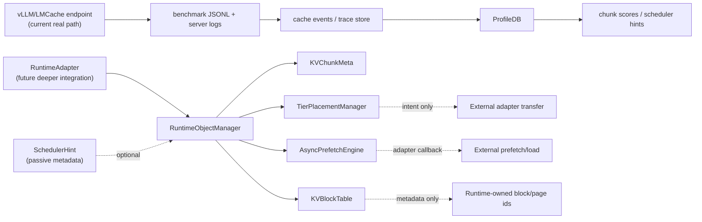

# Runtime Metadata Architecture

Status: core metadata and advisory policy helpers implemented; real serving is
driven through external vLLM/LMCache endpoints and scripts.

Date: 2026-06-26

## Purpose

This document describes the AstraKV-W runtime-facing metadata layer. The project
now has a real endpoint benchmark path through vLLM and LMCache launch scripts,
but the internal `runtime/`, `kv_cache/`, `prefetch/`, `offload/`, and
`scheduler/` packages remain adapter-facing helpers and advisory policy modules.

The current implementation does not modify vLLM, SGLang, LMCache,
TensorRT-LLM, FlashAttention, llama.cpp, or any third-party source tree.

## Non-Goals

- No scheduler implementation.
- No vLLM core modification.
- No CUDA kernel implementation.
- No paged attention implementation.
- No tensor allocation or KV tensor copy.
- No replacement of vLLM internal KV scheduler.
- No claim that advisory policy decisions have moved backend-owned tensors.
- No benchmark execution inside runtime components; real benchmark orchestration
  lives in `scripts/`.

## Module Layout

```text
runtime/
|-- adapters.py
|-- cache_events.py
|-- endpoint_prefetch.py
|-- profile_db.py
|-- trace_schema.py
|-- vm_backend.py
`-- object_manager.py

kv_cache/
|-- metadata.py
|-- block_table.py
`-- partial_load.py

prefetch/
|-- async_engine.py
|-- scorer.py
`-- selective_kv.py

offload/
`-- tier_placement.py

scheduler/
|-- decision.py
|-- hints.py
`-- object_scheduler.py
```

## Core Objects

| Object | Module | Responsibility |
| --- | --- | --- |
| `KVChunkMeta` | `kv_cache.metadata` | Logical metadata for a KV chunk: request, layer, token span, block ids, tier, cache key, adapter metadata. |
| `KVBlockTable` | `kv_cache.block_table` | Runtime-agnostic mapping from chunk ids to block ids and request-owned chunks. |
| `TierPlacementManager` | `offload.tier_placement` | Tracks current/target tier placement intent for chunks. Does not move memory. |
| `AsyncPrefetchEngine` | `prefetch.async_engine` | Tracks prefetch request lifecycle and delegates real work to an adapter callback. |
| `EndpointPrefetchClient` | `runtime.endpoint_prefetch` | Sends OpenAI-compatible warmup requests for real endpoint-level selective prefetch evidence. |
| `CacheEvent` parser | `runtime.cache_events` | Read-only vLLM/LMCache log and benchmark artifact parser. |
| `ProfileDB` | `runtime.profile_db` | Reusable workload/chunk profile built from unified trace events. |
| `RuntimeObjectManager` | `runtime.object_manager` | Composition layer for chunk registration, block-table records, placement state, and prefetch requests. |
| `RuntimeAdapter` | `runtime.adapters` | Protocol for future runtime adapters. |
| `SchedulerHint` | `scheduler.hints` | Passive metadata object; not a scheduler. |

## Boundary Diagram



## Data Flow

1. The current real path starts external vLLM/LMCache endpoints through scripts.
2. Benchmark and server logs are parsed into request results, cache events, and
   trace events.
3. ProfileDB, chunk scores, load/recompute decisions, and object scheduler
   outputs are generated as advisory evidence.
4. A future deeper runtime adapter can receive or observe a runtime request.
5. The adapter maps runtime-owned state into `RuntimeRequest` and
   `KVChunkMeta` records.
6. `RuntimeObjectManager.register_chunk()` stores chunk metadata, adds a
   `KVBlockEntry` to `KVBlockTable`, and registers current placement.
7. A future policy or adapter can call `plan_offload()` to record target tier
   intent.
8. A future adapter can call `prefetch_chunk()` to submit a prefetch request.
9. `AsyncPrefetchEngine` calls the configured adapter callback. The default
   skeleton adapter immediately returns a no-op completed result.
10. `snapshot()` exports inspectable metadata records for debugging,
   documentation, or future benchmark integration.

## Memory Flow

The skeleton does not move memory. It only records metadata about where KV
chunks are believed to live or where they should move next.

Supported placement vocabulary:

- `MemoryTier.GPU`
- `MemoryTier.CPU`
- `MemoryTier.SSD`
- `MemoryTier.REMOTE`
- `MemoryTier.UNKNOWN`

Actual backend-owned tensor movement is still performed by vLLM/LMCache in the
current real experiments. AstraKV-W records and analyzes evidence, sends
endpoint-level warmup requests, and emits advisory policy artifacts. Deeper
memory movement must be implemented later in an adapter layer that calls the
selected backend safely, for example LMCache storage APIs, vLLM KV transfer
connectors, SGLang HiCache, or TensorRT-LLM transfer/tier APIs.

## Adapter Strategy

The skeleton uses adapter boundaries for third-party systems:

- vLLM: future integration should target KV connector metadata or public
  serving/metrics boundaries, not core scheduler edits.
- LMCache: future integration should map `KVChunkMeta` to cache keys and
  storage operations.
- SGLang: future integration should map radix/unified cache events into chunk
  metadata and placement state.
- TensorRT-LLM: future integration should map page/tier descriptors into
  `KVBlockTable` and `TierPlacementManager` records.

## Example Skeleton Usage

```python
from kv_cache import KVChunkMeta, MemoryTier
from runtime import RuntimeObjectManager

manager = RuntimeObjectManager()
chunk = KVChunkMeta(
    request_id="req-1",
    layer_id=0,
    start_token=0,
    end_token=128,
    block_ids=(1, 2, 3, 4),
    tier=MemoryTier.GPU,
)

manager.register_chunk(chunk)
manager.plan_offload(chunk.chunk_id, MemoryTier.CPU, reason="capacity planning")
result = manager.prefetch_chunk_sync(chunk.chunk_id)
snapshot = manager.snapshot()
```

This example records metadata and lifecycle state only. It does not copy KV
tensors or call any third-party runtime.

## Extension Points

- Keep `scripts/run_real_benchmark.py`, `scripts/run_competition_e2e.sh`, and
  `scripts/run_competition_extended_evidence.sh` as the current real endpoint
  execution path.
- Add a vLLM-compatible adapter under `runtime/adapters_vllm.py` only after the
  integration boundary is approved.
- Add LMCache key translation in a separate adapter instead of changing
  `KVChunkMeta`.
- Add policy modules separately from skeleton managers.
- Add tests around metadata lifecycle before adding real transfer code.

## Current Safety Rules

- Keep `third_party/` source trees unmodified.
- Keep scheduler logic out of `scheduler/` until explicitly requested.
- Keep runtime adapters isolated from upstream core internals.
- Keep benchmark code in `scripts/` and `benchmarks/`, not inside skeleton
  manager modules.
