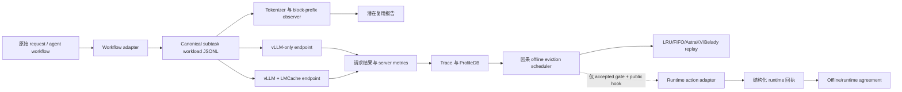

# AstraKV 三路线对接实施计划

> **供执行型 Agent 使用：** 必须逐任务执行本计划；可选择 `subagent-driven-development` 或 `executing-plans`。所有步骤以复选框追踪。

**目标：** 建立一套可审计的 KV Cache 复用观测与证据流水线，覆盖数据集/workflow、因果离线 profiling 到 eviction、以及真实 vLLM/LMCache 性能 profiling 三条路线。

**架构：** 保持现有两条真实服务路径独立：一条是启用 prefix caching 的 vLLM，另一条是 vLLM 加 LMCache CPU/Disk tier。两条路径消费同一 canonical workload，输出相同格式的请求、环境和指标产物。Workflow observer 在执行前计算精确 token/block 复用机会；运行时 telemetry 记录后端实际导出的事实；离线环路只使用历史观测产生建议性 eviction 决策。只有版本锁定的公开 hook 证明对象级执行后，runtime action 才可启用。

**技术栈：** Python 3.12、vLLM 0.23.0、LMCache 0.4.7、PyTorch CUDA 13、Qwen tokenizer、OpenAI-compatible 流式 endpoint、JSONL/CSV/Markdown 产物、Linux `pidstat`/`iostat`/`sar`，以及权限允许时的 Nsight Systems。

## 全局约束

- 本文的“目标仓库”均指服务器端 `Inference-OS` 仓库；所有文件路径均相对仓库根目录。
- 不修改 vLLM、LMCache、CUDA、FlashAttention、Triton 或其他第三方源码目录。
- 不提交服务器变更；保留服务器已有的未跟踪文件和结果目录。
- 第一轮真实实验优先使用 `/opt/models/Qwen3-8B`。该模型为 16 GB BF16、原生 40K 上下文；最终长度须由 tokenizer 预检确定，初始目标设为 32768。`/opt/models/Qwen2.5-7B-Instruct` 仅作为兼容性或资源回退模型。
- 任务一 QASPER ZIP 必须保持不可变：不得增删、重复、混合请求，不得修改问题、答案、ground truth、context，且只允许使用其给定的 `random` 与 `grouped` 排序。
- 必须在文件名、schema、报告和答辩中分开三类证据：`modeled_dataset_metadata`、`log_heuristic`、`runtime_structured`。`vm_poc_execution` 必须与 vLLM/LMCache 结果分开。
- 同一 QASPER 原始数据的 random/grouped 只是同一个语义 workload 的两种排序，不可作为 runtime-action safety gate 所需的两个独立 workload。
- 正式复用和容量结论必须使用真实 tokenizer/chat-template 产生的 token ID；whitespace token 估计只可作预检提示。
- 服务器具有 `perf`、`pidstat`、`iostat`、`sar`、`nsys`、`bpftrace`，但 `perf_event_paranoid=4`；硬件计数器不能作为必要验收条件。

---

## 当前基线与设计选择

### 已核实状态

| 领域 | 已核实状态 | 对方案的影响 |
| --- | --- | --- |
| 硬件 | NVIDIA GB10，compute capability 12.1，PyTorch 可见 128.5 GB 统一内存 | Qwen3-8B 运行 32K 可行。不可把 `nvidia-smi` framebuffer 总量当作内存真实值。 |
| 模型 | 存在 `Qwen2.5-7B-Instruct`、`Qwen3-8B`、`Qwen1.5-MoE-A2.7B-Chat`、DeepSeek-V4-Flash | 先跑 Qwen3-8B；Qwen2.5-7B 作为兼容性/资源回退；149 GB 的 DeepSeek 延后。 |
| 真实路径 | 已有 vLLM-only 与 vLLM+LMCache CPU/Disk 启动路径 | 这两条是首要的非离线基线，必须保留。 |
| 数据集 | QASPER 原始 ZIP 有 200 random 与 200 grouped 请求，估算可复用 token 比例 43.57% | 可作为第一轮直接前缀复用实验，但真实 hit rate 尚未验证。 |
| Workflow | 仓库没有 agent framework 或 subtask callback | 新 observer 必须接受通用 workflow trace，并提供单请求 fallback。 |
| Runtime action | LMCache 有 metrics 与 connector 生命周期代码，但没有已验证的 object-keyed eviction action contract | 先做观测，不能声称已控制在线 eviction。 |

### 三种对接选择

1. **推荐：共享 observer 加两条真实路径。** 一次实现模型感知的 workflow reuse observation，将同一 workload 分别送入 vLLM 与 LMCache，再把 telemetry 输送到因果离线环路。它有受控基线、不破坏上游封装，并能让离线路径解释真实观测。
2. **LMCache-first 直接控制器。** 立即调用 LMCache 内部 storage/eviction 方法。第一轮不采用，因为对象身份与接口稳定性尚未验证，实验会严重绑定版本。
3. **只扩展离线 simulator。** 可用于 policy ablation，但不能作为主结果。它只能作为诊断路线，必须配合 endpoint 实验。

## 完整运行逻辑



在 arrival index `t`，scheduler 只能读取由 `< t` 到达请求形成的 profile state，先写出决策、后观测请求 `t`。Belady 必须始终标记为 offline oracle。不得由 simulator event 伪造真实 endpoint request。

## 产物契约

### Workflow 输入契约

创建 `workflow_trace_v1.jsonl`。每行代表一个已提交 subtask，也覆盖单请求 fallback：

```json
{
  "schema": "astrakv-workflow-trace-v1",
  "workflow_id": "wf-0007",
  "parent_request_id": "req-0042",
  "subtask_index": 1,
  "arrival_index": 42,
  "adapter": "single_request|replay_jsonl|framework_callback",
  "messages": [{"role": "user", "content": "..."}],
  "dataset_id": "qasper",
  "workload_id": "qasper-grouped",
  "metadata": {"source_request_id": "req-0042"}
}
```

Observer 输出 `workflow_reuse_observation_v1.jsonl`，每行必须含有 `input_tokens`、`block_size_tokens`、`prefix_block_hashes`、`historical_reused_tokens`、`historical_reuse_count`、`potential_kv_bytes`、模型/tokenizer/chat-template 标识和 source hash。涉及私有 prompt 时，应哈希 token ID，不在报告中重复原文。

### 证据等级契约

| 产物 | 能证明什么 | 不能证明什么 |
| --- | --- | --- |
| `workflow_reuse_observation_v1.jsonl` | 在声明到达顺序中的精确 token/block 复用机会 | vLLM/LMCache 已实际缓存该对象 |
| `request_results.jsonl` | Endpoint 完成请求、延迟、response usage、质量评测输入 | 对象级 eviction 或 tier movement |
| LMCache/vLLM metrics 与日志 | 后端导出粒度上的 counter/throughput/storage 观测 | 对象身份，除非稳定 key 被导出并验证 |
| Offline simulator report | 声明容量和 cost model 下的策略行为 | Runtime action 真正执行 |
| `runtime_structured` JSONL | schema 验证后的对象级 backend action | 没有 paired benchmark 时不能证明策略收益 |
| mmap VM report | OS VM PoC 的执行回执 | vLLM/LMCache KV tensor 的移动 |

## 文件映射

| 路径 | 职责 |
| --- | --- |
| `astrakv/benchmarks/workflow_observer.py` | Workflow row、chat-template tokenization、block hash 和因果 potential-reuse accounting。 |
| `astrakv/benchmarks/task1_qasper_adapter.py` | 保持任务一 ZIP 不变，同时生成 canonical workload。 |
| `scripts/benchmark/observe_workflow_reuse.py` | 面向 QASPER、replay workflow 与未来 agent callback export 的 CLI。 |
| `scripts/benchmark/run_real_benchmark.py` | vLLM-only 与 LMCache 的共用真实 endpoint runner，写入 run/workflow identity 并启动 metrics collector。 |
| `scripts/benchmark/dgx_metrics_collector.py` | 连续、低侵入地采集 process/CPU/SSD/统一内存样本；不可用字段保持空值。 |
| `scripts/benchmark/inspect_dgx_runtime.py` | 固化版本、模型/tokenizer、启动配置、模型路径和 capability 的 preflight。 |
| `astrakv/runtime/trace_schema.py`、`profile_db.py` | 不可变 raw event 与派生的因果 profile state。 |
| `astrakv/runtime/offline_eviction.py` | LRU/FIFO/AstraKV/Belady 的状态重放、容量、proxy 和 event record。 |
| `astrakv/runtime/offline_safety.py` | 在 action-capable adapter 执行前校验至少三个独立 workload。 |
| `scripts/policy/run_task1_causal_profile_replay.py` | 带 `modeled_dataset_metadata` provenance 的任务一因果 replay。 |
| `scripts/reporting/normalize_runtime_eviction_events.py` | 验证/标准化 runtime event，拒绝将 heuristic log 当作 ground truth。 |
| `tests/test_workflow_observer.py` | token/block identity、排序、无未来泄漏的单元测试。 |
| `tests/test_task1_qasper_adapter.py`、`tests/test_offline_eviction.py`、`tests/test_runtime_eviction_adapters.py` | 数据完整性、因果 simulator、adapter 边界的回归测试。 |
| `configs/workflow_observation_qwen3_8b.yaml` | 首轮 observer 的 block size、tokenizer/model path、输出位置与 workload 元信息。 |
| `docs/guides/three_route_execution_cn.md` | 运行手册与报告用语。 |

## 任务 1：落地共享的数据集与 Workflow 契约

**文件：**
- 新建：`astrakv/benchmarks/workflow_observer.py`
- 新建：`scripts/benchmark/observe_workflow_reuse.py`
- 新建：`configs/workflow_observation_qwen3_8b.yaml`
- 新建：`tests/test_workflow_observer.py`
- 修改：`astrakv/benchmarks/__init__.py`

**输入：** 任务一 prompt JSONL 或通用 `workflow_trace_v1.jsonl`。

**输出：** 不访问 endpoint 的、已校验 subtask record 与 reuse observation。

- [ ] 新增 frozen `WorkflowTraceRow`，字段为 `workflow_id`、`parent_request_id`、`subtask_index`、`arrival_index`、`messages`、`dataset_id`、`workload_id`、`adapter`。
- [ ] 拒绝重复 `(workflow_id, subtask_index)`、重复 arrival index、非法 message role、空 content、非单调 arrival order。
- [ ] 使用 `AutoTokenizer.from_pretrained(model_path, trust_remote_code=True)` 和 `apply_chat_template(messages, tokenize=True, add_generation_prompt=True)` 生成正式 token 序列。
- [ ] 按配置的精确 block size 切分 token ID；对每个 token block 的 canonical JSON 编码计算 SHA-256。
- [ ] 每个 arrival 只能搜索此前出现的 block，写出 `historical_reused_tokens` 与 `historical_reuse_count`，不得读取后续 row。
- [ ] 计算 `potential_kv_bytes = historical_reused_tokens * kv_bytes_per_token`，并保存全部公式输入。
- [ ] 使用三行 fixture：第一、二行共享两个 block 前缀，第三行在其 duplicate 前到达。断言第二行有 reuse、第三行不读取未来信息、改变 chat template 后 hash 改变。
- [ ] 执行：`python -B -m unittest tests.test_workflow_observer -v`。预期：全部通过。

## 任务 2：将任务一作为首个不可变 observation workload

**文件：**
- 修改：`astrakv/benchmarks/task1_qasper_adapter.py`
- 修改：`scripts/benchmark/materialize_task1_qasper_workload.py`
- 修改：`scripts/benchmark/evaluate_qasper_quality.py`
- 新建：`tests/test_task1_workflow_observation.py`

**输入：** 原始任务一 ZIP 及其自身 manifest/hash。

**输出：** random/grouped canonical workflow trace 与审计信息，原始请求内容不变。

- [ ] 每种给定排序恰好 materialize 200 行；保持原始 `messages`、`prompt`、`answer`、`ground_truth`、`request_id` 与 order。
- [ ] 默认将一个 raw request 映射为一个 `single_request` workflow；任务一正式结果不得自行创造 subtask split。
- [ ] 在 audit 中保存 `prefix_id = reuse_group`、`arrival_index = order`、ZIP SHA-256、源 prompt SHA-256 与 `immutability = true`。
- [ ] 写出 observer manifest，记录模型、tokenizer revision、chat-template hash、block size、ZIP hash、输出 hash。
- [ ] 对真实 ZIP 执行只读测试：两种排序均为 200 行、无重复 request ID，且每个 canonical prompt hash 与源 prompt hash 一致。
- [ ] Endpoint serving 前先跑 10 行 random/grouped observation smoke；审查 token length 与 potential-reuse 分布，不预先指定或挑选结果阈值。

## 任务 3：加入可配置的 Agent-Workflow 输入，但不虚构已有 Agent

**文件：**
- 修改：`astrakv/benchmarks/workflow_observer.py`
- 修改：`scripts/benchmark/observe_workflow_reuse.py`
- 新建：`tests/fixtures/workflow_replay_v1.jsonl`
- 新建：`tests/test_workflow_replay_adapter.py`

**输入：** 未来 agent framework 的 callback export，或已记录 JSONL trace。

**输出：** 与任务 1 完全相同的 workflow contract。

- [ ] 首先实现 `replay_jsonl` adapter：验证并观测外部生成的 workflow，不导入也不假设某一 agent framework。
- [ ] 固化 callback export 规范：外部 framework 必须导出 parent request ID、subtask index、时间顺序 arrival index、messages、model identifier、tool-output hash。
- [ ] 不重建 hidden chain-of-thought 或工具原始 payload；只保存 hash 与明确提供的 tokenized message。
- [ ] 提供 `single_request` fallback，使每个 dataset 在 agent framework 到位前都可测量。
- [ ] 测试：相同 messages 下 replay 与 single-request 的 observer 结果相同；顺序错误的 callback export 必须校验失败。

## 任务 4：用预注册 Pilot 决定使用原始数据还是构造 Stress Workload

**文件：**
- 新建：`scripts/reporting/build_reuse_opportunity_report.py`
- 新建：`configs/dataset_pilot_matrix.yaml`
- 新建：`docs/guides/dataset_reuse_protocol_cn.md`
- 新建：`tests/test_reuse_opportunity_report.py`

**输入：** QASPER 和另外两个已命名、语义独立 dataset 的 observer JSONL。

**输出：** 每个 dataset 及合并后的 reuse 分布和不可变选择决策记录。

- [ ] 每个 dataset 用记录 seed 和 source ID 的方式选择 10 条 smoke、20 条 pilot；单请求 baseline 用原始顺序，benchmark 有 grouped 排序时另跑 grouped。
- [ ] 报告 request count、input-token 分布、reusable token ratio、unique prefix block、历史 reuse-count 直方图、估算 KV bytes、精确 duplicated-prefix ratio。
- [ ] 将 `potential reuse` 与任何 backend 导出的 observed hit/load/store 值分开。
- [ ] 决策报告只能是 `raw_workload_selected`、`raw_workload_selected_with_composed_stress`、`observation_incomplete` 三者之一，并包含输入 hash，禁止手挑 request 列表。
- [ ] 如果原始 workload 复用有限，则在独立命名空间构造 `composed_stress`：保留共享 source context prefix，只变更文档化的问题；保存每个 source request ID、template version、seed、输出 hash。
- [ ] 禁止将 composed 结果用于任务一 QASPER accuracy 或官方 random/grouped 结论。
- [ ] 测试：task-one adapter 必须拒绝 composed row；选择报告不得在一张 aggregate 表中混合 raw 和 composed row。

## 任务 5：统一两条非离线服务路径

**文件：**
- 修改：`configs/dgx_spark_vllm_qwen7b.yaml`
- 修改：`configs/dgx_spark_lmcache_cpu.yaml`
- 修改：`configs/dgx_spark_lmcache_disk.yaml`
- 修改：`scripts/launch/launch_vllm_server.sh`
- 修改：`scripts/launch/launch_lmcache_vllm.sh`
- 修改：`scripts/benchmark/run_real_benchmark.py`
- 修改：`scripts/benchmark/dgx_metrics_collector.py`
- 新建：`tests/test_real_workload_request_metadata.py`

**输入：** Canonical workload JSONL、observer manifest、已经启动的 endpoint。

**输出：** 可比较的 vLLM-only、LMCache-CPU、LMCache-Disk 实验目录。

- [ ] 用 `/opt/models/Qwen3-8B` 替换失效本地模型路径；模型路径仅经 config/environment 传递，不能硬编码到 request 逻辑。保留 `/opt/models/Qwen2.5-7B-Instruct` 作为启动失败或资源受限时的明确回退配置。
- [ ] 初始设置 `max_model_len=32768`；当真实 tokenized input 加请求的 output token 超过限制时 preflight 必须失败。
- [ ] 保持 raw dataset 的 `messages` 原样，不得额外包一层 system message。
- [ ] 在 request artifact 中写入 `run_id`、`request_id`、`workflow_id`、`parent_request_id`、`subtask_index`、`arrival_index`、`prefix_id`、`prompt_hash`。Endpoint 接受时发送 `user=request_id`，但不可将其假定为 backend object key。
- [ ] TTFT 定义为第一个非空 assistant content delta 到达的时间；另记 first SSE timestamp 用于诊断。可用时记录 endpoint response ID 与实际 usage。
- [ ] 每个 case 前后启动/停止已有 metrics collector；不可用字段写 null，不能写 0。
- [ ] 每个条件都要跑 `cold` 与 `warm` cache state。Cold 要重启 server 或使用已验证的 cache-clear；Warm 要有单独日志化的 warmup，绝不能静默沿用上个条件的 cache。
- [ ] 使用本地 streaming fixture 测试 payload 不变性、first-content TTFT 和 metadata round-trip。

## 任务 6：构建因果 Offline Profiling 到 Eviction 闭环

**文件：**
- 修改：`astrakv/runtime/trace_schema.py`
- 修改：`astrakv/runtime/profile_db.py`
- 修改：`astrakv/scheduler/object_scheduler.py`
- 修改：`astrakv/runtime/offline_eviction.py`
- 修改：`scripts/policy/run_task1_causal_profile_replay.py`
- 修改：`scripts/policy/run_offline_eviction_simulator.py`
- 新建：`tests/test_causal_workflow_profile.py`

**输入：** Observer output、endpoint trace、声明的 tier capacity。

**输出：** 带证据 provenance 的因果决策和策略比较。

- [ ] 在派生 `ChunkProfile` 聚合前先记录不可变 raw `TraceEvent`。
- [ ] 对请求 `t`，从终止于 `t - 1` 的历史计算 score/action；每条 decision 保存 `profile_history_end_index = t - 1`。
- [ ] 任务一 logical object 仅映射至 `prefix_id`/block-prefix identity，并标记 `modeled_dataset_metadata`；不得标称 vLLM block ID。
- [ ] LRU、FIFO、AstraKV、Belady 必须在完全相同的 GPU/CPU/SSD capacity 和 KV bytes per token 下运行。Belady 输出必须包括 `is_offline_oracle=true`。
- [ ] Raw backend timing 与 proxy timing 分开报告。只有 proxy 时，所有 TTFT/TPOT effect 都要标为 proxy。
- [ ] 用 fixture 测试未来 occurrence 如果泄漏会改善 action 的场景；断言加入/删去后续行不会改变当前 causal decision。

## 任务 7：在不破坏封装的前提下接入 Runtime Evidence 与 Action Gate

**文件：**
- 修改：`astrakv/runtime/cache_events.py`
- 修改：`astrakv/runtime/eviction.py`
- 修改：`astrakv/runtime/offline_safety.py`
- 修改：`scripts/benchmark/inspect_dgx_runtime.py`
- 修改：`scripts/benchmark/verify_structured_eviction_hook.py`
- 修改：`scripts/reporting/normalize_runtime_eviction_events.py`
- 修改：`scripts/reporting/compare_offline_runtime_eviction.py`
- 新建：`tests/test_runtime_evidence_classes.py`

**输入：** Endpoint log/metrics 以及可选的 public structured-hook JSONL。

**输出：** 经验证的 runtime observation，或明确的 `insufficient_ground_truth`。

- [ ] Preflight 采集版本、connector、model/tokenizer、cache config、launch command、workload hash、权限信息。
- [ ] 任何 metrics/log record 默认解析为 `log_heuristic`，除非存在已经验证的 stable object association 与 success receipt。
- [ ] `runtime_structured` 必须具备 `run_id`、`request_id`、`object_key`、`object_level`、`action`、`status`、`timestamp` 和 event-file hash。
- [ ] 在公开且版本锁定的 action API 与 success receipt 被验证前，`VllmLmCacheArtifactAdapter.apply_hint()` 继续返回 `unsupported`。
- [ ] 只有至少三个语义独立 workload manifest、且每个都有独立 profile source 通过 offline safety gate 后，才允许 action-capable adapter。
- [ ] 测试：disk-write log 不能生成 runtime F1；未验证 event 不得进入 comparison denominator；rejected gate 不得调用 action callback。

## 任务 8：不改内核也要使性能证据具有说服力

**文件：**
- 修改：`scripts/benchmark/diagnose_runtime.py`
- 修改：`scripts/reporting/compare_real_runs.py`
- 修改：`scripts/reporting/build_competition_report.py`
- 新建：`scripts/reporting/build_three_route_report.py`
- 新建：`docs/guides/three_route_execution_cn.md`
- 新建：`tests/test_three_route_report.py`

**输入：** Paired endpoint run、observer report、sidecar sample、offline simulator report、可选 structured receipt。

**输出：** 一份明确区分 real/offline/unavailable evidence 的总报告。

- [ ] 最小非离线矩阵：vLLM-only random/grouped，LMCache CPU random/grouped；CPU 成功后再增加 LMCache Disk random/grouped。每个条件至少重复 5 次。
- [ ] Random/grouped 配对必须固定模型、tokenizer、prompt set、output cap、并发、cache state、GPU budget、CPU capacity、disk capacity、launch config。
- [ ] 报告 success rate、first-content TTFT p50/p95、TPOT p50/p95、end-to-end latency p50/p95、实际 input/output token、throughput、vLLM/LMCache counter、host/cgroup memory、process I/O、disk queue/latency 与失败原因。
- [ ] 增加 QASPER EM/token-F1 作为 backend/model variant 的质量护栏；不得把 answer quality 解释为 cache metric。
- [ ] Nsight Systems 只用于每条路径的一次代表性诊断，其 timeline 不得混入 aggregate throughput 统计。`pidstat`、`iostat`、`sar` 是默认的低权限长期探针。
- [ ] DCGM、NVML framebuffer、`perf`、structured-hook 不可用时写 `not_available`，不能写零。
- [ ] 生成 evidence matrix，每个 claim 一行：reuse opportunity、observed cache behavior、offline policy result、VM PoC receipt、runtime action receipt、endpoint performance benefit。

## 执行顺序与验收 Gate

| Gate | 必需工作 | 通过条件 | 未通过后的处理 |
| --- | --- | --- | --- |
| G0：契约 | 任务 1-3 | Unit test 通过；真实 QASPER ZIP 可无变更 materialize | 不启动 endpoint 实验 |
| G1：观测 | 任务 4 | 三个 dataset 的 pilot 有 immutable report，或诚实标为仅 QASPER/incomplete | 只使用 raw QASPER；不得编造官方数据 |
| G2：Endpoint smoke | 任务 5 | Qwen3-8B 在兼容 32K 配置下完成三条 random 和三条 grouped 请求 | 先诊断 model/tokenizer/context，再跑完整矩阵；失败时切换到已记录的 Qwen2.5-7B 回退配置 |
| G3：真实比较 | 任务 5、8 | Paired vLLM/LMCache 产物含 manifest、request record、log、sample | 不发布 backend-performance claim |
| G4：因果策略 | 任务 6 | No-lookahead test 通过；各策略使用相同 capacity | Offline 结果仅作诊断 |
| G5：Runtime evidence | 任务 7 | Public structured event verifier 通过 | 输出 `insufficient_ground_truth`；不得发布 runtime F1/action claim |
| G6：Action | 任务 6、7 | 三个独立 workload 通过 safety gate，且 public action API 返回 receipt | 保持 `apply_hint=unsupported` |

## 报告用语规则

- G3 后可以说："在相同 workload 和配置下，grouped ordering 改变了 endpoint-level latency/counter behavior。"
- G4 后可以说："因果 simulator 在声明的容量与 proxy 假设下选择了不同策略。"
- G5 后可以说："经验证的 backend event 显示 offline decision 的一致或不一致。"
- G6 后可以说："版本锁定的 public backend adapter 执行了带 receipt 的记录动作。"
- 未通过 G5/G6 前，禁止说："vLLM KV block 已被 eviction"、"AstraKV 控制了 LMCache eviction"、"disk I/O 证明 eviction"、"warmup 就是 block-level prefetch"。

## 计划自检

- 数据集路线覆盖不可变 QASPER、通用 agent-workflow 输入、raw/composed 选择与 source provenance。
- 循环路线覆盖因果 profiling、simulator policy、safety gate、runtime evidence 和当前缺少 public action API 的事实。
- Perf/profiling 路线覆盖两条真实服务路径、cold/warm 配对、质量护栏、GB10 统一内存限制和低权限诊断 fallback。
- 没有任务要求修改上游内核，也没有任务将 simulator/log 当成 runtime ground truth。
- 当前尚未命名的两个 dataset 仅作为配置输入；实现阶段不得编造其来源、许可证或预处理规则。
